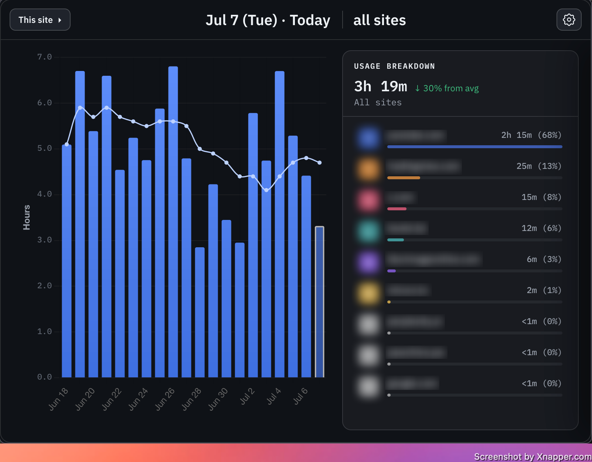
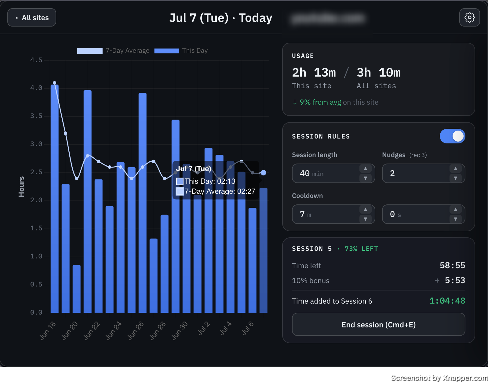

# WebTime

> Track and take control of your time.

A browser extension for Firefox and Chrome that tracks how long you spend on
each site, with a small timer in the corner of your screen, and gives you the
tools to spend that time mindfully. It uses **session-based browsing** that's both disciplined and
flexible — focused sessions, gentle nudges, and cooldowns when a limit is reached.

## Screenshots

| All sites | Single site |
|:---:|:---:|
|  |  |

## Install

WebTime is published on
[Firefox Add-ons (AMO)](https://addons.mozilla.org/en-US/firefox/addon/web-time/)
and the Chrome Web Store.

You can also install the latest build directly from
[GitHub Releases](https://github.com/andres-al-campos/WebTime/releases). Each
release carries two packages:

- `web_time-<version>.zip` for Firefox: load it via `about:addons` → ⚙️ →
  **Install Add-on From File…**.
- `web_time-chrome-<version>.zip` for Chrome: unzip it, then
  `chrome://extensions` → **Developer mode** → **Load unpacked** and pick the
  unzipped folder.

For development, see [Loading the extension](#loading-the-extension) below.

## Philosophy

WebTime favors **awareness, then accountability**. Most of the time it just
keeps you informed: a quick visual pulse early, an awareness popup when you're
approaching your typical usage, and a 60-second wind-down near a session's end.
Only once you've actually exceeded a session limit does a cooldown block the
page — a real pause, made flexible by carryover and the option to end a session
early on your own terms.

## Features

**Visualize your data**

- **Per-domain time tracking** with a small on-page timer (shows the current
  session by default; click to peek at today's total).
- **Usage chart** in the toolbar popup — track individual sites over time, and
  expand any day for a detailed breakdown.
- **7-day moving averages** to spot patterns, plus a popup when you cross ~80%
  of your trailing 7-day average for a domain.
- **All your data stays local** — nothing leaves your browser. Settings shows
  how much is stored, and exports the lot to JSON whenever you want a copy.
  Storage holds years of history; a banner warns before the oldest days start
  being overwritten.

**Mindful accountability**

- **Minimalist nudges** — brief overlays that get more frequent as a session
  nears its end (sparse early, accelerating late), without interrupting your flow.
- **Session limits with cooldowns** — after continuous use past a configurable
  limit, a cooldown blocks the page; each successive cooldown grows.
- **End a session early** — unused time rolls over to your next session, plus an
  extra 10% on top, so stopping early is rewarded, not punished.
- **Wind-down mode** — a bar across the top of the page that drains down over
  the final 60 seconds of a session, a visible heads-up that time's almost up.
- **Per-site limits** — customize what works for each site. Your time, your
  decisions.

## Architecture

Functional core, imperative shell. Decisions and arithmetic are pure modules in
`src/shared/` with no browser APIs, tested with `node --test`. Effects —
messaging, storage, alarms — live in the background script.

| Path | Role |
|------|------|
| [`src/background.ts`](src/background.ts) | The shell: tab and focus listeners, message dispatch, storage, alarms, and the state the gates read. |
| [`src/content.ts`](src/content.ts) | In-page UI: the timer widget, blur overlay, nudge animation, and all dialogs. |
| [`src/popup/`](src/popup/) | The toolbar popup — chart building, data processing, state, and UI, bundled to `popup-bundle.js`. |
| [`src/offscreen.ts`](src/offscreen.ts) | Chrome only: an offscreen document that keeps the MV3 service worker alive. |
| [`src/shared/time-clock.ts`](src/shared/time-clock.ts) | Timestamp accounting (`banked` + `runningSince`), so a worker that dies mid-count loses nothing. |
| [`src/shared/clock-gates.ts`](src/shared/clock-gates.ts) | Whether time should be accruing right now. The gate order is load-bearing and tested. |
| [`src/shared/session-model.ts`](src/shared/session-model.ts) | Session lifecycle math — boundaries, carryover, nudge timing, grace, wind-down, wake schedules. |
| [`src/shared/interventions.ts`](src/shared/interventions.ts) | Which intervention is due: limit reached, nudge. |
| [`src/shared/session-history.ts`](src/shared/session-history.ts) | The per-day record of finished sessions. |
| [`src/shared/time-history.ts`](src/shared/time-history.ts) | Reading the tracked-time store across format versions. A store written by a newer build is refused, never half-read. |
| [`src/shared/storage-health.ts`](src/shared/storage-health.ts) | How full storage is, in bytes rather than days. |
| [`src/shared/data-export.ts`](src/shared/data-export.ts) | The exported-backup payload, which names itself so it stays readable without the extension. |
| [`src/shared/protocol.ts`](src/shared/protocol.ts) | Every string that crosses a boundary: message types, storage keys, alarm and port names. |
| [`src/shared/utils.ts`](src/shared/utils.ts), [`constants.ts`](src/shared/constants.ts), [`src/types.ts`](src/types.ts) | Formatting helpers, tuning defaults, shared types. |

One source builds both browsers. [`extension/manifest.json`](extension/manifest.json)
is the Firefox (MV2) manifest and the single source of truth;
[`manifest-chrome.mjs`](manifest-chrome.mjs) derives the Chrome (MV3) manifest
from it and assembles `dist-chrome/`. The design record for the port is in
[`docs/chrome-mv3-port.md`](docs/chrome-mv3-port.md).

## Development

Requires Node. All build tooling — esbuild and
[`web-ext`](https://github.com/mozilla/web-ext) — is pinned as a dev dependency,
so a fresh `npm install` is the only setup; nothing needs a global install.

```bash
npm install        # install all dev dependencies (esbuild, web-ext, tsc)
npm run typecheck  # tsc --noEmit
npm test           # run the node:test suites in test/
npm run build      # typecheck + bundle to extension/dist/ and dist-chrome/
npm run watch      # tsc in watch mode
```

`npm run build` bundles `background.ts`, `content.ts`, `offscreen.ts` and the
popup into `extension/dist/` (see [`build.mjs`](build.mjs)), then assembles the
Chrome build in `dist-chrome/`. Those bundled files are what the manifests load.

### Full build + package

[`build.sh`](build.sh) is the canonical "ship it" command. It runs the
typecheck, then the tests, then packages both store zips into `artifacts/`: the
Firefox one with the project-local `web-ext`, the Chrome one straight from
`dist-chrome/`. Both loadable directories are refreshed in place.

```bash
./build.sh
```

Because it gates on the tests, a failing suite aborts the package step. Debug
logging and source maps are on for a plain `./build.sh` and compiled out by
`release.sh`, so a release ships neither.

Only what the extension loads is packaged: store listing artwork lives in
`store-assets/`, outside the two loadable directories, because both packagers
copy `images/` wholesale.

## Loading the extension

Run `npm run build` first so both loadable directories are populated.

**Firefox:** `about:debugging` → **This Firefox** → **Load Temporary Add-on…**
and select [`extension/manifest.json`](extension/manifest.json). Temporary
add-ons are removed when Firefox restarts.

**Chrome:** `chrome://extensions` → **Developer mode** → **Load unpacked** and
pick `dist-chrome/`. After a rebuild, hit reload ⟳ on the card; open tabs get
the new content script automatically.

Test on both. Chrome's keep-alive re-derives state constantly and hides a class
of bug that Firefox's persistent background does not.

## Releasing

[`release.sh`](release.sh) tags a version and publishes its build to
[GitHub Releases](https://github.com/andres-al-campos/WebTime/releases). The version is
read from [`manifest.json`](extension/manifest.json) — the single source of
truth — so the tag and the build can never disagree.

```bash
./release.sh
```

It is deliberately strict, and will refuse to run if:

- the working tree is **dirty** (a release tag must match committed code),
- local commits are **not pushed** to `origin`,
- a release for the current version **already exists** (bump the version first).

When the checks pass it builds fresh via `build.sh` and attaches both zips to
a `v<version>` release, with notes auto-generated from the commits since the last
release. To cut a new release: bump `version` in `manifest.json` (and
`package.json`), commit, push, then run `./release.sh`.

## Testing

Tests live in [`test/`](test/) and run via `node --test`. Each suite bundles the
relevant `src/shared/` module with esbuild and imports the **real** source (no
copy-pasted logic), so tests can't silently drift from the implementation.
Every pure module has a suite; the two that matter most are
[`clock-gates`](test/clock-gates.test.mjs) (a playing video must keep counting)
and [`session-model`](test/session-model.test.mjs).

A few suites, notably [`background-wiring`](test/background-wiring.test.mjs),
assert against `background.ts` as source text. That is blunt, and used only
where the failure is silent and needs a browser to reproduce, such as a dialog
gate that freezes the clock forever.

```bash
npm test
```
